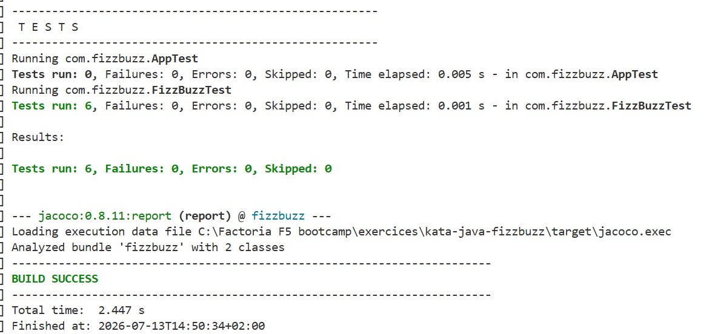
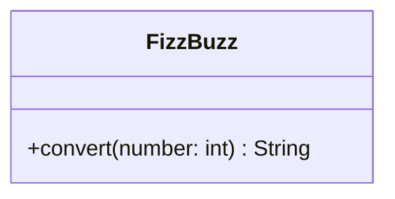

# FizzBuzz Kata in Java

## Description

This project is a programming kata that is part of the **Factoría F5** bootcamp.

The program must evaluate the numbers from 1 to 100 and return the corresponding result according to the following rules:

### Stage 1

- Return `Fizz` if the number is divisible by 3.
- Return `Buzz` if the number is divisible by 5.
- Return `FizzBuzz` if the number is divisible by both 3 and 5.
- Return the number itself if none of the previous conditions are met.

### Stage 2

- Return `Fizz` if the number is divisible by 3 or contains a `3`. 
- Return `Buzz` if the number is divisible by 5 or contains a `5`.
- When both the `Fizz` and `Buzz` conditions are met, return `FizzBuzz`.

## Technical requirements

- JDK 21
- Maven
- JUnit 5
- Hamcrest

## Deliverables

The `FizzBuzz` class must be properly tested, all scenarios must be covered, and the test coverage must be visible.
### Unit tests

 ### Coverage report

### Class diagram

